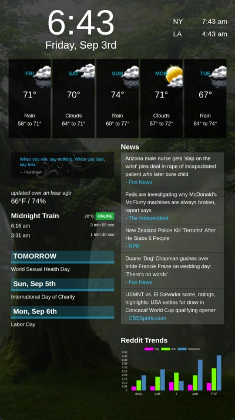

# dashboard
A web based dashboard that is used as a digital bulletin board.



In order to build this project, you will need to create a API.js file in the src directory and add the required API keys from the different services. The file should look like below.

src/API.js
```javascript
export const Keys = {
    WEATHER: '[API KEY]',
    CALENDAR: '[API KEY]',
    NEWS: '[API KEY]',
    TRELLO: {
        API_KEY: "[API KEY]",
        TOKEN: "[TOKEN]",
        BOARD: "[BOARD ID]",
        LIST: "[LIST ID]",
    }
}
```
